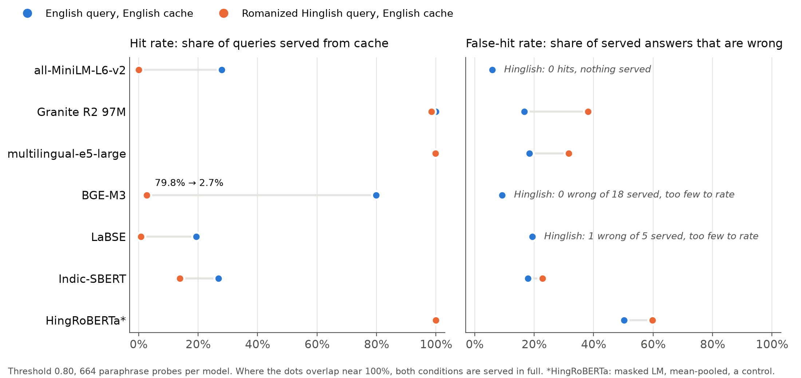
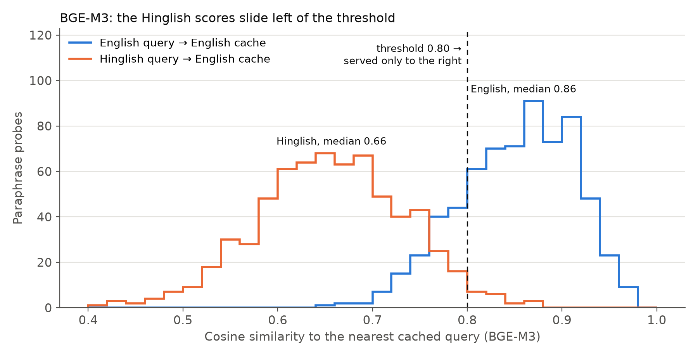

# hinglish-semantic-cache-eval

Does a semantic cache still work when users type romanized Hinglish and the cache holds English answers?

This repo holds a three-way parallel evaluation set of support queries (English, Devanagari Hindi, romanized Hinglish), a small cache harness, and the scripts behind the blog post [*My Semantic Cache Didn't Fail on Hinglish. It Switched Off.*](https://medium.com/@prasaddhend/my-semantic-cache-didnt-fail-on-hinglish-it-switched-off-1ca9c8b76f28).

It is a companion to the paper *Cache-Hit Reliability Under Romanized Hindi–English Code-Mixed Queries: Isolating Script and Mixing Effects in LLM Semantic Caches* (Arti Patle, Prasad Dhend, Tulsi Choudhari). The paper is a preprint in preparation, not yet submitted anywhere. Citation to follow.

## Result (θ = 0.80, English cache, 664 paraphrase probes per model)

| Model | English FHR / HR | Hinglish FHR / HR |
|---|---|---|
| sentence-transformers/all-MiniLM-L6-v2 | 5.9% / 28.0% | no hits / 0.0% |
| ibm-granite/granite-embedding-97m-multilingual-r2 | 16.7% / 100.0% | 38.1% / 98.5% |
| intfloat/multilingual-e5-large | 18.4% / 100.0% | 31.7% / 99.8% |
| BAAI/bge-m3 | 9.2% / 79.8% | 0 wrong of 18 served / 2.7% |
| sentence-transformers/LaBSE | 19.4% / 19.4% | 1 wrong of 5 served / 0.8% |
| l3cube-pune/indic-sentence-similarity-sbert | 18.0% / 26.8% | 22.8% / 13.9% |
| l3cube-pune/hing-roberta (mean-pooled, control) | 50.3% / 100.0% | 59.8% / 100.0% |

- **FHR** (false-hit rate) = wrong answers served / all answers served.
- **HR** (hit rate) = queries served from cache / all queries.

Read the two together. A low FHR on a cache that barely fires means the cache is switched off, not that it's safe. Confidence intervals and paired bootstrap tests are in `results/para_only_summary.json`.




## Known issue: duplicate hard negatives

Each intent has 2 hard negatives, and each is labelled with a sibling intent's equivalence class. **328 of the 332 English hard negatives are word-for-word copies of that sibling's canonical query**, which is itself in the cache, so they score 1.0 and count as correct hits. The same is true of 277 of the 332 romanized ones. They don't test near-misses, and they inflate English hit rates.

The table above therefore uses paraphrases only. `results/raw/exp02_threeway_degradation.json` is the original all-probe run (996 probes, hard negatives included), kept for comparison. Details are in [`results/hard_negative_issue.md`](results/hard_negative_issue.md). A corrected hard-negative set is planned.

## Data

`data/annotated/{en,hi_deva,hi_rom}.jsonl` has 1,162 records per condition. These are 166 intents across 6 support categories, each with 1 canonical query, 4 paraphrases and 2 hard negatives. Rows with the same `role` are index-aligned across the three files.

```json
{"record_id": "account.reset_password__canonical__hi_rom__001", "intent_id": "account.reset_password",
 "equivalence_class_id": "account.reset_password", "condition": "hi_rom", "role": "canonical",
 "text": "main apna password kaise reset karu?", "provenance": {"source": "llm_assisted", ...}}
```

**How it was made.** The data is synthetic. An LLM drafted it, and the rows were then reviewed by hand against [`data/guidelines/annotation_guidelines.md`](data/guidelines/annotation_guidelines.md). Spelling variation in romanized Hindi ("kaise", "kaisay", "kese") was left in on purpose. The data contains no real user queries, company data or personal data.

A second annotator checked a stratified 15% sample (350 rows) and agreed on 99.1% of rows (Gwet's AC1 0.991).

## Run it

Python 3.10 or 3.11, CPU is fine.

```bash
python -m venv .venv
.venv\Scripts\activate          # Windows;  source .venv/bin/activate elsewhere
pip install -r requirements.txt
pytest -q                                          # unit tests, no model downloads
python experiments/exp02_threeway_degradation.py   # all 7 models, all probes -> results/raw/
python experiments/probes_and_charts.py            # paraphrase-only numbers, near-misses, charts
python experiments/rank_metrics.py                 # Recall@k / MRR / nDCG@5 vs hit rate on the same vectors (run after the above)
```

The first run downloads the seven models from Hugging Face, which takes a few GB. Set `HF_HOME` to point the download somewhere else. Embeddings are cached in `results/embeddings/`, keyed by model and text hash, so re-runs are fast. Every non-timing number reproduces exactly with seed 42.

## Layout

```
data/          three-way parallel set, seed intents, annotation guidelines
src/           cache (store, hit/miss decision), dataset loading, embedding registry, metrics + bootstrap stats
experiments/   exp02 (degradation run), probes_and_charts.py (post 1 numbers + charts),
               rank_metrics.py (post 2: ranking metrics vs cache decisions, charts 3-6)
results/       JSON outputs, the hard-negative note, figures
tests/         unit tests
```

`rank_metrics.py` is blog-side analysis and stays out of `src/`: with one relevant cached entry per probe, Recall@1, MRR and nDCG@5 depend only on the rank of the correct entry, while the cache decision depends only on the top-1 score. It reproduces `para_only_summary.json` exactly (rank-1 counts, hits, median similarity) and exits if it doesn't; `tests/test_rank_metrics.py` guards the same.

The mitigation experiments (transliteration via IndicXlit, per-language thresholds) are not in this repo yet. They'll come with a later post.

## Licence

- **Code:** MIT (see [`LICENSE`](LICENSE)).
- **Data** (`data/`): CC BY 4.0 (see [`data/LICENSE-DATA.md`](data/LICENSE-DATA.md)).

